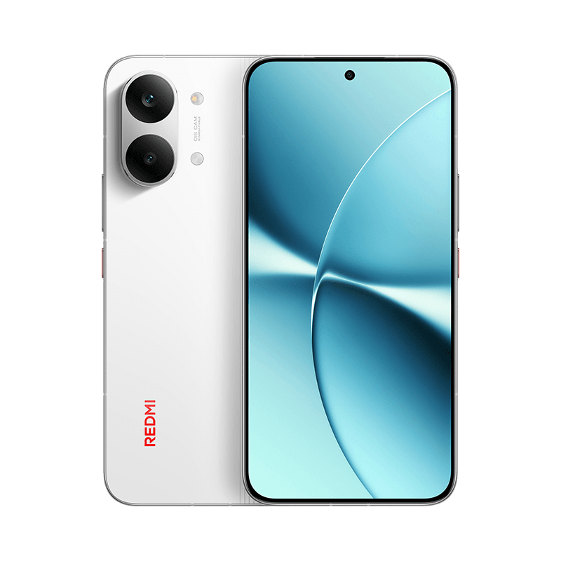

Redmi Turbo 5 Max 设备详情 (LineageOS 23.2)
=============================================

[EN](README.md) | 简体中文

Redmi Turbo 5 Max 是一款~~拿上一代MTK旗舰芯片阉割后的~~MTK正代满血高性能旗舰，配备6.83英寸， 120Hz 高刷 AMOLED 屏与 9000 毫安 小米金沙江电池。

## 省流

### 已知问题

- 随机掉入 BROM 模式。（可能与 MiTEE 有关，没实锤）
- 部分可复用的 HyperOS 特性尚未整合

### 没测试

* 功耗 / 温控
* 快速充电
* 有线反向充电
* VoWiFi

### 能用的

* 移动通信 / VoLTE
* Wi-Fi
* 蓝牙
* NFC
* 相机
* 音频
* 传感器
* GPS
* 息屏显示
* 屏下指纹
* USB OTG
* 休眠与唤醒
  * 抬起唤醒
  * 注视唤醒
  * 双击唤醒
* 加密
* SELinux 强制模式

### 没打算

* 面部解锁

## 设备详情

基本信息  | 详细参数
---------:|:---------------------------------------------------------
SoC       | 联发科 天玑 9500s (MT6991Z/ECZB, 台积电 3 nm)
CPU       | 八核：1x 3.73 GHz Cortex-X925 & 3x 3.30 GHz Cortex-X4 & 4x 2.40 GHz Cortex-A720
GPU       | Immortalis-G925 MC12
RAM      | 12/16 GB LPDDR5X
ROM      | 256/512 GB / 1 TB UFS 4.1
出厂系统  | Android 16 (澎湃OS 3)
电池      | 9000 mAh 硅碳负极电池, 100W 有线快充 (PPS/PD3.0), 27W 有线反向充电
屏幕      | 6.83" AMOLED, 1280 x 2772 (1.5K), 120 Hz, 3840 Hz PWM 调光, 杜比视界 / HDR10+ / HDR Vivid, 3500 nits 峰值亮度
后置相机  | 50 MP f/1.5 主摄 (OIS) + 8 MP f/2.2 超广角
前置相机  | 20 MP f/2.2
尺寸      | 163 x 77.9 x 8.2 mm, 219 g
防护等级  | IP66 / IP68 / IP69 / IP69K
生物识别  | 屏下超声波指纹
连接功能    | Wi-Fi 7, Bluetooth 5.4, NFC, 红外遥控, USB-C 2.0

## 设备外观 (Device picture)

## 开源协议 (License)

[Apache-2.0](LICENSE)
